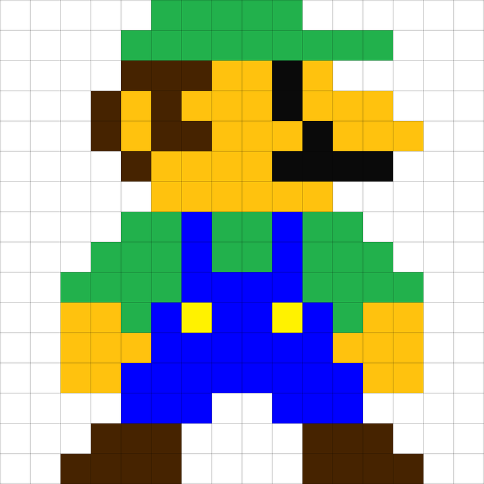

# Notes

Workshop: 2018-11-17, 17:00-18:30, 90 minutes.

# Outline

## Introduction, problem setting (15 min)

* What is the problem?
* What are solutions? Text, GUI, various domains? 

## What is luigi? (15 min)

* A framework or library
* DAG
* Task
* Target
* Command line integration

## Create a first task

