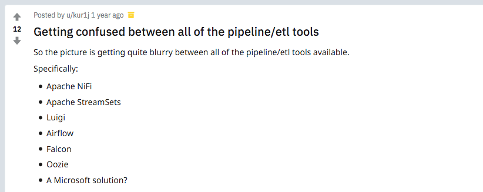
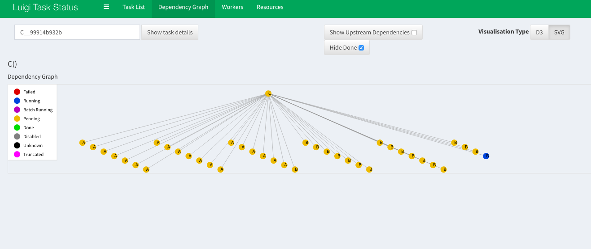

# batchdata

Batch data processing with [luigi](https://github.com/spotify/luigi). A short introduction.

Workshop at [PyCon Balkan](https://pyconbalkan.com), Belgrade, 2018-11-17, 17:00-18:30


# Setup

* Python 3 (3.6.4)

Clone (or fork) this repo:

```
$ git clone https://github.com/miku/batchdata.git
$ cd batchdata
```

Prepare your isolated setup and install the requirements (mostly just luigi,
maybe ipython for a better console):

```
$ pip install -r requirements.txt
```

# TOC

* [History](https://github.com/miku/batchdata#history)
* [Example 1: Basics](https://github.com/miku/batchdata#example-1-basics)
* [Example 2: Creating output](https://github.com/miku/batchdata#example-2-creating-output)
* [Example 3: Parameters](https://github.com/miku/batchdata#example-3-parameters)
* [Example 4: Defining dependencies](https://github.com/miku/batchdata#example-4-dependencies)
* [Example 5: WordCount](https://github.com/miku/batchdata#example-5-wordcount)
* [Visualization](https://github.com/miku/batchdata#visualization)
* [Extensions](https://github.com/miku/batchdata#extensions)
* [Wrap Up](https://github.com/miku/batchdata#wrap-up)

# History

* Python framework open sourced by Spotify [September 24th,
  2012](https://developer.spotify.com/community/news/2012/09/24/hello-world/)

> It's a Python module that helps you build complex pipelines of batch jobs,
> handle dependency resolution, and create visualizations to help manage
> multiple workflows. Luigi comes with Hadoop support built in.

> We use Luigi internally at Spotify to run thousands of tasks every day,
> organized in complex dependency graphs. Luigi provides an infrastructure that
> powers several Spotify features including recommendations, top lists, A/B test
> analysis, external reports, internal dashboards, and many more.

Conceptually, Luigi is similar to [GNU Make](https://www.gnu.org/software/make/)
where you have certain tasks and these tasks in turn may have dependencies on
other tasks.

In 2018, one of the original authors works on other interesting things - and
there are more alternatives and sites for this problem.

It's a smaller open-source project, with currently 10435 stars on GitHub, 537
people on the mailing list with about 905 topics.

# User list

* https://github.com/spotify/luigi#who-uses-luigi

Example uses:

* Processing Hotel Reviews with Python
* Create index of scientific articles of heterogeneous sources
* Bioinformatics (http://uppnex.se/twiki/do/view/Courses/EinfraMPS2015/Luigi.html)

> Luigi is a little special compared to most other workflow solutions, that the
> dependency graph is by default defined by hard-coding the upstream dependent
> task, inside each task. In this regard, luigi tasks are quite similar to
> funcitons in functional programming, where each function knows everything
> needed to provide it's answer, including all the other functions that need to
> be executed to get there.

# Random things from the mailing list

## Can Luigi replace my clunky build framework?

> Over the last decade or so I implemented my own dependency 'pipeline'
> framework for scientific computing, and it is in desperate need of a major
> overhaul that I would rather not do (well mostly not).  I've just discovered
> Luigi which is surprisingly similar in concept, but much much more solid and
> complete

## Open source projects that use Luigi

> I'm refactoring an ETL process which is built on Luigi and am rethinking our
project organization. One of our most common tasks is to standardize and
integrate a given type of dataset as acquired from dozens of different sources
in various formats. An example may be building a nationwide database of
property records by acquiring, standardizing, and integrating property records
from dozens or hundreds of local governments, all of which have completely
different source formats.

# Extensions, Branches

* https://github.com/pharmbio/sciluigi

> A light-weight wrapper library around Spotify's Luigi workflow system to make
> writing scientific workflows more fluent, flexible and modular.

* https://github.com/scipipe/scipipe, http://scipipe.org/

> SciPipe is a library for writing Scientific Workflows, sometimes also called
> "pipelines", in the Go programming language.

* https://github.com/miku/gluish, utilities around luigi

# Alternatives

* http://bytepawn.com/luigi-airflow-pinball.html
* https://soundcloud.com/the-airflow-podcast/episode-4-competitors



# What is luigi?

* three core notions: task, target, dependency
* as opposed to other frameworks, everything is Python (and not, say XML)

# Task

* a task is defined a python class
* has mostly three methods: `requires`, `run` and `output`

# Target

* is the output (or outcome) of a task
* this can be a file, but also an entry in a database, index, remote file (s3,
  ftp), file on a distributed file system (hdfs)

# Dependency

* a task can declare zero, one or more dependencies
* if a task has dependencies, they need to be present and fulfilled, before the task can run

# Scheduler

* luigi comes with two schedulers: local for development and a "central" scheduler (which you can also run locally)
* the scheduler runs workers, which execute tasks (in parallel) - with multiple
  users, also makes sure, two instances of the same task are not running
simultaneously
* the scheduler provides an API, which can be used for visualization

# Example 1: Basics

Creating a simple class, testing the command line integration.

### Your task

Edit the file `Basics/main.py` and fill in the blanks.

For example, if the task would be named `Hello` this would might be the output:

```shell
$ python main.py Hello --local-scheduler
/Users/tir/.virtualenvs/batchdata/lib/python3.6/site-packages/luigi/parameter.py:284: UserWarning: Parameter "task_process_context" with value "None" is not of type string.
  warnings.warn('Parameter "{}" with value "{}" is not of type string.'.format(param_name, param_value))
DEBUG: Checking if Hello() is complete
/Users/tir/.virtualenvs/batchdata/lib/python3.6/site-packages/luigi/worker.py:401: UserWarning: Task Hello() without outputs has no custom complete() method
  is_complete = task.complete()
INFO: Informed scheduler that task   Hello__99914b932b   has status   PENDING
INFO: Done scheduling tasks
INFO: Running Worker with 1 processes
DEBUG: Asking scheduler for work...
DEBUG: Pending tasks: 1
INFO: [pid 81698] Worker Worker(salt=360519278, workers=1, host=apollo.local, username=tir, pid=81698) running   Hello()
Hello World
INFO: [pid 81698] Worker Worker(salt=360519278, workers=1, host=apollo.local, username=tir, pid=81698) done      Hello()
DEBUG: 1 running tasks, waiting for next task to finish
INFO: Informed scheduler that task   Hello__99914b932b   has status   DONE
DEBUG: Asking scheduler for work...
DEBUG: Done
DEBUG: There are no more tasks to run at this time
INFO: Worker Worker(salt=360519278, workers=1, host=apollo.local, username=tir, pid=81698) was stopped. Shutting down Keep-Alive thread
INFO:
===== Luigi Execution Summary =====

Scheduled 1 tasks of which:
* 1 ran successfully:
    - 1 Hello()

This progress looks :) because there were no failed tasks or missing dependencies

===== Luigi Execution Summary =====
```

# Example 2: Creating Output

Outputs can be more than files, so they are called targets. A local file is a
`luigi.LocalTarget` and allows for typical operations on files:

* `open`, `exists`, `copy`, `move`, `remove` and more methods
* has a `path`

You can inspect the available methods in the console:

```python
>>> target = luigi.LocalTarget(path='my.file')
>>> f = target.open('w') #
>>> type(f)
luigi.format.TextWrapper
>>> f.
f.buffer         f.detach         f.fileno         f.line_buffering f.read           f.readlines      f.tell           f.write
f.close          f.encoding       f.flush          f.name           f.readable       f.seek           f.truncate       f.writelines
f.closed         f.errors         f.isatty         f.newlines       f.readline       f.seekable       f.writable
```

This wrapper implements atomic file writes, so only when the file is closed, the
target path will be present.

### Your task

Fill in the blanks in `CreateOutput/main.py`.

# Example 3: Parameters

Tasks can have parameters, why are automatically turned into command line
arguments. They are typed (int, strings, date, date ranges).

* `luigi.Parameter`, defaults to string
* `luigi.IntParameter`
* `luigi.DateParameter`

All parameters are "required", but can specify a default via `default` keyword parameter.

When running, command line args get turned into parameters (with type checks), a
parameter `my_param` could be specified via:

```
$ python main.py --my-param
```

When running with the `help` flag, a optional given `description` will be
displayed (if specified as keyword argument to the parameter):

```
$ python main.py --help
```

In the task, you can access the parameter value as a simple attribute. This
attribute will have the type of the parameter (e.g. string, int or datetime
object).

### Your task

Fill in the blanks in `Parameters/main.py`.

Here is some expected error at some point:

```
...
luigi.parameter.MissingParameterException: ... requires the 'name' parameter to be set
```

# Example 4: Dependencies

Things get interesting, when workflows get a bit more complicated as they
require certain inputs.

Tasks can add a `requires` method which returns a task (or list or dict of
tasks) that need to be done, before the task can run.

How does the the framework determines, if a task has been run?

* either looking at the target (e.g. if a file exists, which is possible due to atomicity)
* or task implements a separate `complete` method that does custom checks

Here is how it could look like:

```python
class SomeTask(luigi.Task):

    def requires(self):
        return OtherTask(self)

    def run(self):
        f = self.input().open()
        # read from a (possibly LocalTarget) object
```

Note: The input of the dependent task is available via `self.input` (which
refers to the *output* of the other task already, *not* the task object itself). So
the output of the `OtherTask` being a typical `LocalTarget` you can just open
and read from it.

### Your task

Fill in the blanks in `Dependencies/main.py`.

This is a two task sequence. One tasks produces some synthetic data, e.g. the
number of plays of a song in a country (tld):

```
call me maybe	me	65
gangnam style	rs	100
gangnam style	rs	45
battle scars	hr	64
call me maybe	me	17
call me maybe	si	32
battle scars	si	18
gangnam style	ba	93
call me maybe	me	60
battle scars	ba	45
```

Your task is to implement a basic aggregation for a single country.

Here is one possible output:

```
===== Luigi Execution Summary =====

Scheduled 2 tasks of which:
* 1 complete ones were encountered:
    - 1 Producer()
* 1 ran successfully:
    - 1 TopSongs(tld=rs)

This progress looks :) because there were no failed tasks or missing dependencies
```

One possible output could be:

```
$ cat top-rs.file
gangnam style	529
battle scars	268
call me maybe	115
```

# Example 5: WordCount

Classic wordcount. Short code review of
[https://github.com/spotify/luigi/blob/master/examples/wordcount.py](https://github.com/spotify/luigi/blob/master/examples/wordcount.py).

# Visualization

Example for visualization in `Visualization/main.py` which requires `luigid` to
be running ([http://localhost:8082](http://localhost:8082)).



It is possible to run tasks in parallel by specifying the number of workers.

```shell
$ python main.py --workers 4
```

There is a `Makefile` in the `Visualization` directory to clear the dummy output
with:

```
$ make clean
```

# Extensions

There are various target types, most of them can be found in:

* https://github.com/spotify/luigi/tree/master/luigi/contrib

Other extension points:

* subclassing tasks (e.g. gluish.BaseTask for automatic paths)
* creating new parameter types
* writing tooling around luigi

# Wrap Up

Experiences, advantages and disadvantages.
